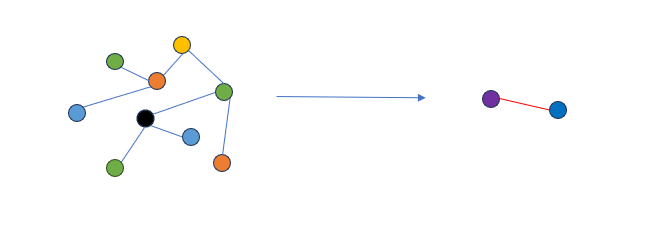
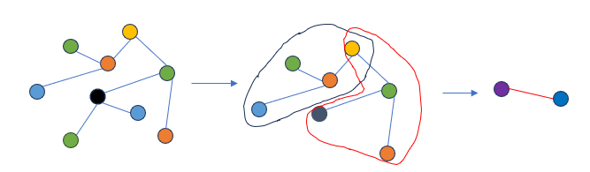
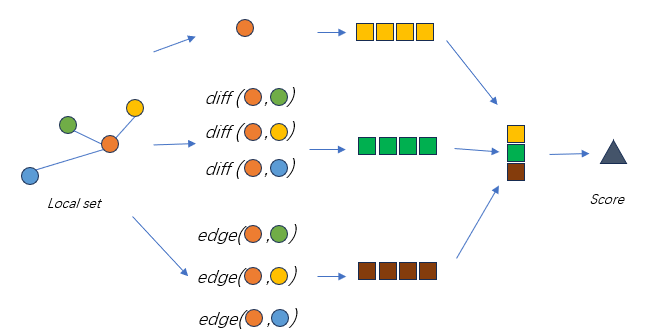

# LSPool
Local Set Pooling (LSPool) is a hierarchical graph pooling that learns to coarsen input graphs from *local set*.
LSPool is *localized*, *adaptive* and *trainable*. Its density depends on the density of input graphs.

## local set
LSPool assumes that for each node, the localized sub-graph contains the node and its neighbours determines whether this node presents in the pooled graph. 
This sub-graph is call *local set*. A local set is formed by a central node, its one-hop neighbours and edges connecting them.

## Structure
LSPool uses two message passing layers(MP) to learn and construct the pooled graph. 
Local set score MP(LSSMP) learns a score for each local set. The nodes whose local sets have the top-k scores are kept. 
The node features are updated by local set collapse MP(LSCMP), which collapses the nodes of a local set into one node. If two nodes have intersected local set in original graph, there is an edge between them in the pooled graph.  

### LSSMP
LSSMP learns the score from three features: the central node attributes, the difference between central node and neighbours, the possible edge attributes.

**LSSMP**

$$f_1 = w_1*x_i$$

$$f_2 = w_2*maxagg(abs(x_j-x_i)) \quad for \quad j \ \in \ N \left( i \right)$$

$$f_3 = w_3*meanagg(e_{ij}) \quad for \quad j \ \in \ N \left( i \right)$$

$$score_i = w*concate \left( f_1, f_2, f_3 \right)$$

where $x_i$ is the attribute of node $i$, $e_{ij}$ is the attribute of edge that connects node $i$, and $j$ and $N\left(i\right)$ is the one-hop neighbour of node $i$.
$w_1$, $w_2$ are learnable vectors of size $\left(f_x, 1\right)$, where $f_x$ is the dimension of node attributes. 
$w_3$ is a learnable vectors of size $\left(f_e, 1\right)$, where $f_e$ is the dimension of edge attributes. $w$ is a learnable vectors of size $\left(3,1\right)$ or $\left(2,1\right)$.

### LSCMP
LSCMP collapse a local set into a node in pooled graph by aggregating the node attributes with scores learned.

**LSCMP**

$$x' = sum\left(x_j * score_j\right)  \quad for \quad j \ \in \ N \left( i \right) \cup \{i\}$$